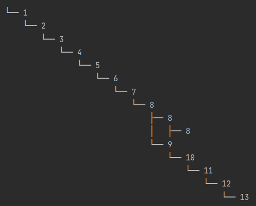
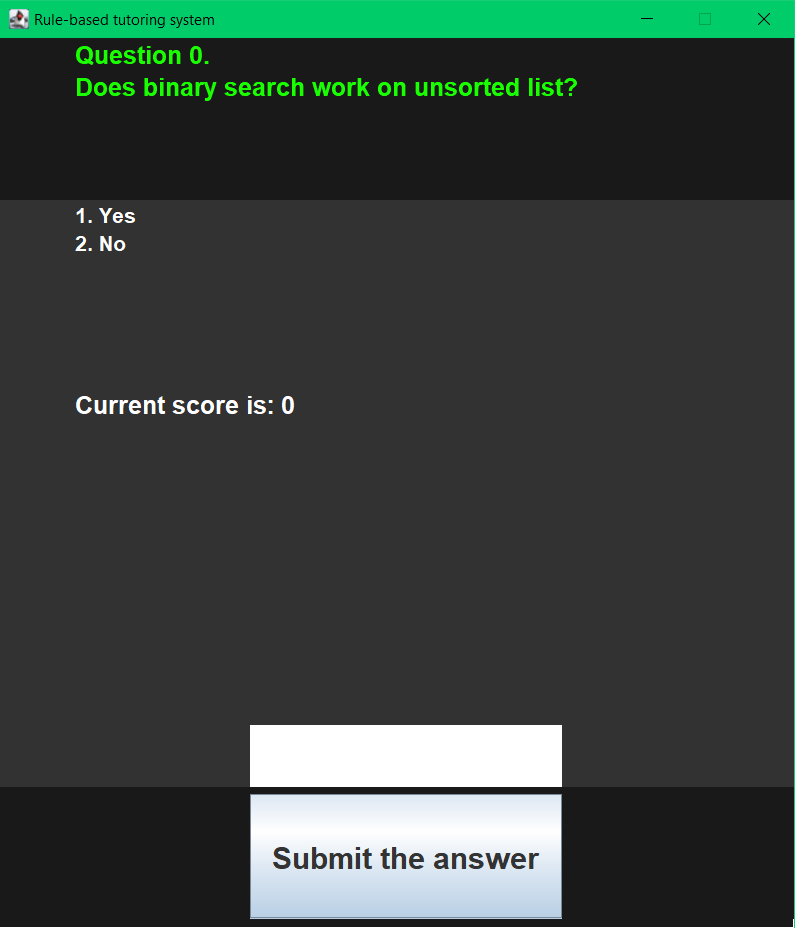

# Rule-based tutoring system 

**&raquo; System simulating the judgement and behavior <br> of a human expert using AI concept** <br/><sub> _Expert System_ &middot; _Inference Engine Algorithm_ &middot; _Binary Search Tree & Tree Bindings_ &middot; _Artificial Intelligence_</sub>

---

## What are Rule-based expert systems?
The paradigm of the rule-based expert system _RBES_ (rule-based tutoring system emphasises purpose) has components that make it comparable to the conventional system we would encounter daily. However, the major difference from the traditional system is that it is at the heart of Artificial Intelligence. Meaning that foundation of thy system is [$\color{white}{\underline{heuristic \space search}}$](https://data-flair.training/blogs/heuristic-search-ai/) since it does not include elements of neural networks or machine learning. The state at which AI is now could be described as a curve opposite to backtracking due to its delay. The form of AI that the expert system follows is continuous steps without going back, as it has been present in the 90s with the chess game, where no step back can be taken. Traditional computation, in contrast, executes every instruction after the previous, where an instruction is equivalent to the rule in the expert system. The dissimilarity between them comes from the way they are selected since the conventional system selection is [$\color{white}{\underline{deterministic}}$](https://en.wikipedia.org/wiki/Deterministic_system) and the rule-based system is [$\color{white}{\underline{non-deterministic}}$](https://en.wikipedia.org/wiki/Nondeterministic_algorithm).


 A deterministic algorithm would always compute the same results for particular inputs. An expert system cannot predict what is going to be the next step of execution since there are numerous pathways a system can take. In brief, it is a replacement for the standard model of computation. Once we have a program called $\color{white}{P}$, its role is to transform the assertions in the working memory $\color{white}{W}$. If we have any assertions, they are controlled by the executor $\color{white}{E}$. Considering all of the definitions, the rule-based systems would produce a formula: $\color{white}{RBES:\{P,W,E\}}$   

<sub>_Still not finding what you are looking for? Try the [Wikipedia](<https://en.wikipedia.org/wiki/Expert_system>)!_</sub>

#### Contents
- **[1 Methodology of the project](#1-methodology-of-the-project)**
  - [1.1 Rules, their application, and aftereffect a.k.a. Cyclic process](#11-rules,-their-application,-and-aftereffect-a.k.a.-cyclic-process)
  - [1.2 Control mechanism (Inference engine)](#12-control-mechanism-(Inference-engine))
  - [1.3 Syntax and Build](#13-syntax-and-build)
  - [1.4 Deduction technique as predefined regulations](#14-deduction-technique-as-predefined-regulation)
- **[2 Algorithm](#2-algorithm)**  
  - [2.1 Functionality and necessity](#21-functionality-and-necessity)
  - [2.2 Data-flow diagrams](#22-data-flow-diagrams)
- **[3 System in action](#3-system-in-action)**  
  - [3.1 Check if RBES can be executed](#31-check-if-rbes-can-be-executed)
  - [3.2 Results](#32-results)

## 1 Methodology of the project

### 1.1 Rules, their application, and aftereffect a.k.a. Cyclic process
As it was stated, the feature differentiating this model of computation from the traditional one is the control over the working data transformations. Once we compare it to the procedural model, the _RBES_ rules order at which they would be executed is unknown in advance. An example of known conditional statements in programming syntax has a meaning behind it in addition to the importance, which is a contradiction to the production systems functionality. Previously mentioned executor $\color{white}{E}$ also known as the interpreter functions on behalf of $\color{white}{E:\{S,A,M\}}$. It is a cyclic process of the expert system in which the selection of correct rule happens from the conflict set $\color{white}{S}$ where action $\color{white}{A}$ emerges concerning how it was defined to lastly deriving new satisfied rules by matching $\color{white}{M}$. In addition, it respects the dynamic run-time characteristics which lead to expensive and temporally redundant processes while comparisons $\color{white}{M}$ of all productions $\color{white}{R}$ against working memory data happen. In a case where a successfully matched production for the particular cycle is discovered, they are added to the conflict set. A production $\color{white}{p_o}$ is considered to be successfully matched if its antecedents: $\color{white}{(a_{o1}\&a_{o2}\&...a_{on})}$ is consistent with the state at which the working memory is at the time $\color{white}{w_o}$ meaning a $\color{white}{p_o\theta\subseteq w_o}$ . This would result in following extended version which is $\color{white}{(a_{o1}\& a_{o2}\&...\&a_{on})\theta \subseteq w_o}$ , where $\color{white}{\theta}$ is a substitution. The last consideration is about the selection of a rule from the conflict set, but it is purely  $\textcolor{yellow}{\textit{based on the strategy of choice}}$ depending on what are the $\textcolor{yellow}{\textit{predefined regulations}}$.
Eventually, the executor will finish the actions specified by the rules and will make those possible conclusions:
- The goal was reached by the interpreter therefore, it does not continue executions, and its operation of it is terminated.
- The goal was not reached, and there is no data in the conflict set to work with what leads to termination.
- The goal was not reached, but the conflict set still has assertions (possibly new facts) that satisfy some rules and control mechanism that continues the cycling process.

### 1.2 Control mechanism (Inference engine)
The project is constructed by utilization of so called [$\color{white}{\underline{RuleBook \space by \space Delivered \space Technologies \space Labs}}$](https://github.com/deliveredtechnologies/rulebook) that takes the role of a rule engine necessary for the project. It has presented a simple representation of the syntax that had a familiar look when it would be compared against the other choices. The project required the development of the expert system with an application of an inference engine (also known as a control mechanism) that is supported by own algorithm.

### 1.3 Syntax and Build
 The components needed, alongside the required functionalities of the system, can be formed out of what this engine provides in a wide range of syntax choices. If we go to the resource page about RuleBook [$\color{white}{\underline{Baeldung.com}}$](https://www.baeldung.com/java-rule-engines) the utility of the _lambda functions_ is obviously coherent with formal description given in the first section. This feature of Java JDK8 that as we can compare to the above descriptions, has the elements such as entailment operator, antecedents (left-hand side of lambda) and consequents, (right-hand side of lambda).

 The method of choice applies [$\color{white}{\underline{first \space order \space logic}}$](https://en.wikipedia.org/wiki/First-order_logic) since the rule-based system applies the use of variables together with constants. Providing variables to the system and declaration of rules with the constants allows its further functionality. As the system collects $\color{white}{facts}$, the library has allowed the use of a storage structure called $\color{white}{FactMap}$ whose functionality is to allow storage of the facts. Returning to a description about the creation and deletion of assertion, the functionality that this unit offers ensures that no concerns should appear about data manipulation (used in the example below). In the same way, the use of a class called $\color{white}{Auditor}$ allows tracking of what rules were executed/skipped or not included due to a wrong syntax. An advantage coming off the features of this library is that it aids to be as the developer thinks of the syntax. For example, "given" some facts "when" the data meets the criteria "then" make an action about that data. To implement this library it has been added to the project structure file called _"XML"_ as it is specified in the [$\color{white}{\underline{documentation}}$](https://github.com/deliveredtechnologies/rulebook#1-getting-rulebook). This type of file can be expected in build managers such as Gradle or Maven. For this project Maven has been chosen. 
 
 Syntax required the creation of a RuleBook variable and using it to prepare a set of heterogeneous rules necessary for tutoring purposes. Once this step was taken, the environment was ready and awaited the data that can be supplied during the interaction with the user. When the data is collected from the user, it can be changed to facts and stored in the container. Naturally, the type of data comes to the first-order logic.

<sub>_Want to know more about Rules and their practical use? Check this > [Rules](<https://github.com/deliveredtechnologies/rulebook#31-given-when-then-the-basis-of-the-rulebook-language>)!_</sub>

<sub>_Want to know more about Facts? Have a look at this section > [Facts](<https://github.com/deliveredtechnologies/rulebook#34-working-with-facts>)!_</sub>

### 1.4 Deduction technique as predefined regulation
As we have mentioned in the second section there is a need for $\textcolor{yellow}{\textit{predefined regulations}}$. Going back to what the control mechanism section has specified, it is $\textcolor{yellow}{\textit{"based on the strategy of choice"}}$ therefore, full freedom in this area is possible. However, the number of strategies does not consider dozens of options but rather few since they are defined definitely. The choice of a deduction technique in the early stage was based on what Allen Newell has proposed in one of his publications. He has specified four ways that could be used to make deduction much easier with a technique of conflict resolution. He has specified four ways that could be used to make deduction much easier with a technique of conflict resolution:
- No duplication - means that no rule should be executed twice on the same data given.
- Recency - choose the rule that has recently created working memory assertions.
- Specificity - choose the more specific rule (perhaps rules that will be fired uniquely on the suitable data).
- Operation priority - make sure that actions were ranked by priority and pick the highest.

RBES uses a combination of specificity and no duplication. It implies that each rule was created in a manner of making it trigger solely on a specific piece of data. The second technique was technically imposed using the rule engine library syntax. That is introduced by the technicality of how the facts use unique identification. Each fact has a unique $\color{white}{ID}$ attached to it, meaning that at a phase of tutoring, there exists only one possible answer for the given question. An example could be a fact $\color{white}{F1}$ that passes the answer $\color{white}{S}$ being a first-order logic number 2. In the case where this information goes to working memory, and it is a wrong answer, no action will be taken since there was no match $\color{white}{M}$. Based on the $\color{white}{ID}$, the fact went to the corresponding rule, but the variable within the fact was incorrect. Although if the answer is correct and it is stored in this fact, the specific rule will look at the $\color{white}{ID}$ of the fact and check its variable leading to a trigger and action. On the whole, the deduction can be performed easily by the control mechanism algorithm without worrying about the instantaneous run time of the rules that would be horrendously difficult to work with in other way.

<sub>[[Top 🢁](#contents)]</sub>

## 2 Algorithm

### 2.1 Functionality and necessity
 The control mechanism algorithm is the heart component of the whole system. It co-operates with the user and the other components ( such as question display and interface) of the program to deliver the expected functionality. The $\textcolor{white}{\textit{Algorithm 1}}$ presents a set of steps taken each time a new question is displayed to a user, and the interface button is clicked to continue. Firstly the algorithm initializes the data structure necessary for data storage used in the latter once other steps will clarify. An index is a variable used to check whether more questions are available. Next, it collects the user data from the interface text field and stores it in a local variable. On completion, it would use this index number to create a unique ID which looks as follows: $\color{white}{(F + index = F1\ OR\ F2\ OR\ F3...)}$. Furthermore, when the current "$\color{white}{Data}$" is changed to fact $\color{white}{F}$ then it is stored in the structure $\color{white}{FactMap}$. The deduction of the system goes back to Newell's technique of making the facts unique by the index besides the uniquely specified rules, which await the correct $\color{white}{ID}$ and data associated with the fact. The `rules()` method is used to start the cycling process of selection of correct rules to fire the action from these rules. In the case where a proper deduction has been completed, and the goal is reached, the auditor looks at the status of the rules and saves those which meet the criteria. $\color{white}{RuleBindingsBST}$ is a container for the relationships between the rules fired in each phase where it means a question at the current iteration. Going back to the `rules()`, it can lead to previously mentioned outcomes of the control mechanism. One of them would be a returned score for the correct answer to a given question and the continuity of the processes, whereas the other one would be a lack of data to work with and no feedback given to the ultimate termination of the system.
 


### 2.2 Data-flow diagrams
Understanding of the section 2.1 as well as the whole system overall can be completed by use of Data-flow diagrams, where the first one goes back to the inference engine and second to the system as a whole. 
As we can observe the images are self-explanatory and provide an extra perspective. 


<sub>[[Top 🢁](#contents)]</sub>

## 3 System in action

### 3.1 Check if RBES can be executed

To run the RBES you need to have installed [JDK](https://www.oracle.com/java/technologies/downloads/) on your machine.
The version of the JDK to execute this program should be _17.0.1_.
Check if you have the JDK installed by opening a terminal and typing :

```bash
javac -version
java -version
```

or

```bash
java -version && javac -version
```

In the case where a version specified above was given back by the terminal similarly to one below you can execute the code.

```bash
17.0.1
java version "17.0.1" 2020-10-20
```

### 3.2 Results

Due to difficulty of the RuleBook package provided by Delivered Technologies Labs it is advised to run the program in the integrated development environment of own choice for a guarantee of execution of the code without issues of importing. 

On successful completion of going through these steps, you should be able to view the result below :




<sub>[[Top 🢁](#contents)]</sub>


<!-- 
The implementation of rule-based tutoring system.
It implements:
1. The control mechansim known as the inference engine.
2. Forward chaining deduction.
3. Use of first order logic as the input from the user.
4. Graphical user interface.
Based on all of those elements a functioning and read for enhancment tutoring system has
been developed to challenge the currect problems of software of this type.
These problems include:
1. Service related effort such as creating of an account.
2. Need for internet connection
3. Limited data used for questions.
4. Similarity between those systems.
5. No results at the end of the system to lure user into some action. 
6. Being created at some expected level of education.

The result is a non-deterministic system which at the moment allows a practice of Algorithm by showing a 35 distinct questions
that can be repeated as many time as necessary. A feedback is given in form of a score and the treestructure of the user's 
achievement.
A.N. -->
